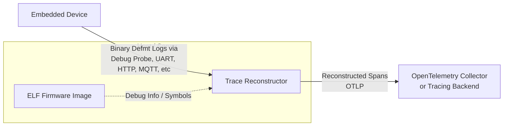

# tracing-defmt


A **syntax-compatible** facade for [tracing](https://github.com/tokio-rs/tracing) that outputs directly to [defmt](https://github.com/knurling-rs/defmt).

## Overview

`tracing` is the de-facto standard for instrumentation in the Rust ecosystem. `defmt` is the gold standard for high-efficiency logging on embedded devices.

However, using `tracing` with a subscriber on embedded systems often forces a compromise:
1.  **Type Erasure**: `tracing` erases types into `dyn Value`, forcing the subscriber to use `fmt::Debug`.
2.  **Formatting on Device**: To log these erased values, one must typically use `defmt::Debug2Format`, which performs formatting on the device, negating `defmt`'s bandwidth and size savings.

`tracing-defmt` resolves this by providing macros that **look** like `tracing` macros but **expand** to `defmt` macros at compile time. This allows you to write code using the familiar `tracing` API while enjoying the full efficiency of `defmt`.

## Architecture

The following diagram illustrates how `tracing-defmt` enables the reconstruction of distributed traces on the host from minimal binary logs generated on the embedded device.



## Installation

Add this to your `Cargo.toml`:

```toml
[dependencies]
tracing-defmt = "0.1"
defmt = "0.3"
```

## Usage

### Basic Usage

You can import the crate as `tracing` to minimize code changes:

```rust
use tracing_defmt as tracing;

fn main() {
    let x = 42;
    tracing::info!("Hello world! x={}", x);
    tracing::warn!("Something might be wrong...");
}
```

### With `#[instrument]`

The `#[instrument]` attribute is supported and expands to a `defmt` log on entry and exit.

```rust
use tracing_defmt as tracing;

#[tracing::instrument]
fn my_function(x: u8, y: u8) {
    tracing::debug!("Inside my_function");
}
```

### Host vs Embedded Usage

Since `defmt` is designed for embedded targets and requires a global logger, running `tracing-defmt` code directly on a host machine (e.g. `cargo test`) usually produces no visible output (or requires specific decoders).

To get the best of both worlds—**standard tracing logs on host** and **efficient defmt logs on embedded**—you should use conditional compilation in your `Cargo.toml`.

#### 1. Configure Cargo.toml

Define features to switch between the real `tracing` crate and `tracing-defmt`.

```toml
[features]
default = ["std"]
std = ["dep:tracing"]
embedded = ["dep:tracing-defmt", "dep:defmt"]

[dependencies]
# Optional dependencies
tracing = { version = "0.1", optional = true }
tracing-defmt = { version = "0.1", optional = true }
defmt = { version = "0.3", optional = true }
```

#### 2. Import conditionally

In your code, conditionally import the crate you need:

```rust
#[cfg(feature = "std")]
use tracing;

#[cfg(feature = "embedded")]
use tracing_defmt as tracing;

#[tracing::instrument]
fn process_data(data: &[u8]) {
    tracing::info!("Processing {} bytes", data.len());
}
```

Now:
- Run `cargo test --features std` -> Uses standard `tracing`. Logs appear in stdout (if a subscriber is set).
- Run `cargo build --features embedded --target thumbv7em-none-eabihf` -> Uses `tracing-defmt`. Logs are efficient binary `defmt` packets.

## Features & Limitations

- **Macros**: `trace!`, `debug!`, `info!`, `warn!`, `error!` map directly to their `defmt` counterparts.
- **Attributes**: `#[instrument]` is supported. Arguments must implement `defmt::Format`.
- **Fields**:
    - `tracing::field::display(x)` is supported via a wrapper that uses `defmt::Display2Format`.
    - `tracing::field::debug(x)` is supported via a wrapper that uses `defmt::Debug2Format`.
- **Spans**: `span!` macros (`info_span!`, etc.) exist to allow code to compile, but they are currently **no-ops** (dummies). `defmt` does not support the same concept of runtime-constructed spans with attached key-value pairs in the same way `tracing` does.
- **Events**: `event!` macro maps to the corresponding log level macro.

## Testing

This crate includes a test suite that verifies the macros compile and run on the host (though output is hidden as it uses `defmt`).

To run the tests:

```bash
cargo test
```

See `examples/` for usage patterns.
